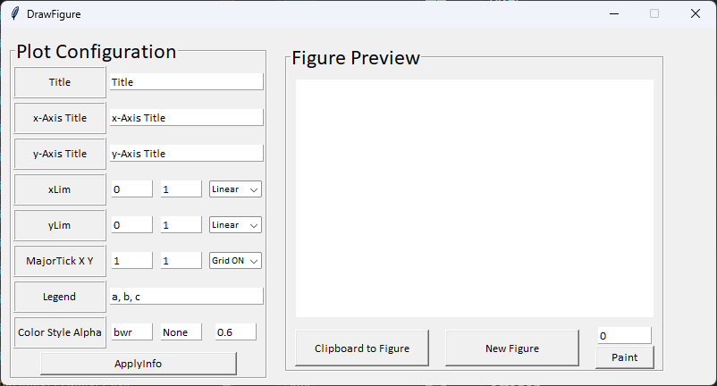

# Figure

This project aims to draw figure from two-dimensional clipboard data. 

- Why is This Required? 
  - 
  - An image could be easily drawn by other software, such as excel and origin, however the style of excel is not appropriate to the scientific figure. In addition, software drawing figure such as origin requires license.

- What you can do?
  - 
  - This project enables you to draw scientific figure without purchasing these software. 
  - This project is likely to be applicated with another project, including calculating physical phenomenon such as electromagnetics.  

- Prerequisite Packages
  - 
  - numpy, pandas, matplotlib

- How to Use?
    - 
    - 1. Clone this repository and run Figure.py. Then, the below window will be loaded. 
        
    - 2. In the Plot Configuration panel, insert Title, x-axis title, y-axis title, xlim, ylim, axis scale, MajorTick X Y, Legend, Color, Line Style, Alpha value. All style follow matplotlib package. In the Legend configuration, the entries should be seperated by ", "
 
    - 3. Push ApplyInfo Button.
    - 4. Push New Figure Button.
    - 5. Copy two-dimensional data on clipboard.
    - 6. Push Clipboard to Figure Button.
    - 7. Repeat the 5 and 6 steps until drawing the number of entries on Legend.
    - 8. (Optional) Insert center of x value you would like to emphasize and push Paint Button.

